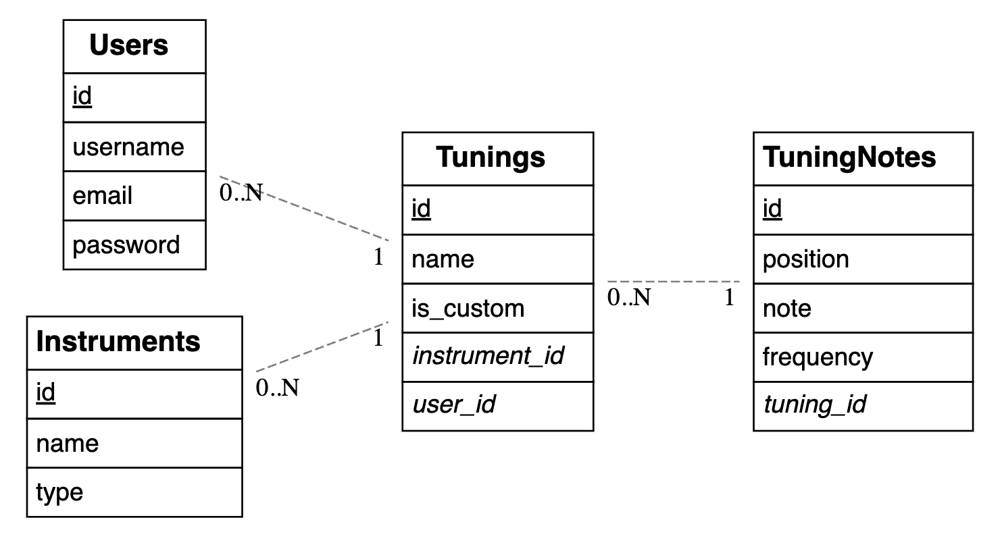

# Brent Vervaet (187068bv)

- [ ] Front-end Web Development
    - <GITHUB_REPO_LINK_HIER>
    - <LINK_ONLINE_VERSIE_HIER>
- [X] Web Services:
    - https://github.com/Web-IV/2324-webservices-BrentVervaet.git
    - <LINK_ONLINE_VERSIE_HIER>

**Logingegevens**

- Gebruikersnaam/e-mailadres:/
- Wachtwoord:/

## Projectbeschrijving

Een tuner API. Het houdt een databank bij waar INSTRUMENTS instaan die op verschillende manieren kunnen gestemmed
worden (Standaard , Drop D ,etc...).
Deze worden bij gehouden bij een TUNINGS tabel dat bestaat uit NOTES.
Bij notes wordt begehouden bij wel ze tuning horen en op welke positie ze staat (snare, toetsen ,gaten). Ook hebben ze
de frequentie opgeslagen om eventueel later een losse stemmer te maken (puur van opnamen kunnen aantonen welke noot het
is).

Wanneer de user een instrument kiest kan hij een tuning kiezen en zo helpen zijn instrument te stemmen.
Er zijn verschillende pre-tunings, maar de user kan ook zijn custom tunings aanmaken en dan deze opslaan.

Laten zou ik eventueel nog een soor GUEST user maken die alleen de standaard tunings kan raadplegen, of alleen de
universele stemmer.

## API calls

### Instruments

- `GET /api/instruments`: alle instrumenten ophalen
- `GET /api/instruments/:id`: instrument met bepaald id ophalen
- `GET /api/instruments/:type`: instrumenten van bepaalde types ophalen
- `POST /api/instruments`: instrument aanmaken
- `PUT /api/instruemnts/:id`: instrument met bepaald id aanpassen
- `DELETE /apin/instruments/:id`: instrument met bepaald id verwijderen

### Notes

- `GET /api/notes`: alle notes ophalen
- `GET /api/notes/:id`: note met bepaald id ophalen
- `POST /api/notes`: note aanmaken
- `PUT /api/notes/:id`: note met bepaald id aanpassen
- `DELETE /api/notes/:id`: note met bepaald id verwijderen

### Tunings

- `GET /api/tunings`: alle tunings ophalen
- `GET /api/tunings/custom`: alle custom tunings ophalen
- `GET /api/tunings/:id`: tuning met bepaald id ophalen
- `POST /api/tunings`:  tuning aanmaken
- `PUT /api/tunings/:id`: tuning met bepaald id aanpassen
- `DELETE /api/tunings/:id`: tuning met bepaald id verwijderen

### Health

- `GET /api/health/ping`: ping ophalen
- `GET /api/health/version`: version ophalen

### Users

- `GET /api/users`: alle gebruikers ophalen
- `GET /api/users/:id`: gebruiker met een bepaald id ophalen

## Behaalde minimumvereisten

### Web Services

- **datalaag**

    - [x] voldoende complex (meer dan één tabel, 2 een-op-veel of veel-op-veel relaties)
    - [x] één module beheert de connectie + connectie wordt gesloten bij sluiten server
    - [x] heeft migraties - indien van toepassing
    - [x] heeft seeds
       

- **repositorylaag**

    - [x] definieert één repository per entiteit (niet voor tussentabellen) - indien van toepassing
    - [x] mapt OO-rijke data naar relationele tabellen en vice versa - indien van toepassing
       

- **servicelaag met een zekere complexiteit**

    - [x] bevat alle domeinlogica
    - [x] bevat geen SQL-queries of databank-gerelateerde code
       

- **REST-laag**

    - [x] meerdere routes met invoervalidatie
    - [x] degelijke foutboodschappen
    - [x] volgt de conventies van een RESTful API
    - [x] bevat geen domeinlogica
    - [x] geen API calls voor entiteiten die geen zin hebben zonder hun ouder (bvb tussentabellen)
    - [x] degelijke authorisatie/authenticatie op alle routes
       

- **algemeen**

    - [x] er is een minimum aan logging voorzien
    - [x] een aantal niet-triviale integratietesten (min. 1 controller >=80% coverage)
    - [x] minstens één extra technologie
    - [x] maakt gebruik van de laatste ES-features (async/await, object destructuring, spread operator...)
    - [x] duidelijke en volledige README.md
    - [x] volledig en tijdig ingediend dossier en voldoende commits

## Projectstructuur

### Web Services

- tests
    - common
    - coverage
    - rest
- config
- node_modules
- src
    - core
    - data
        - migrations
        - seeds
    - repository
    - rest
    - service

## Extra technologie

### Web Services

Pnpm gebruikt ipv yarn.
Wou swagger nog implementeren maar het brak mijn oorspronkelijke code en had dus geen tijd meer voor het te
implementeren.

## Testresultaten

### Web Services

Voornamelijk instrumenten getest, niet alle testen laten juist verlopen door tijd druk.

## Gekende bugs

### Web Services

Ik wou een tabel hebben voor tunings waarin bestaande tunings staan die vrij te verkrijgen zijn maar waar ook custom
tunings instaan die door de user zijn aangemaakt en zijn opgeslaan. Dit is niet meer gelukt door een bepaalde bug van de
foreignkeys ergens met user_id. Zal dit later nog proberen uitwerken

Niet online kunnen zetten doordat de mail niet meer te vinden was. Waarschijnlijk in spam automatisch verwijderd na
zoveel tijd.

## Wat is er verbeterd/aangepast?

Is de eerste keer dat ik het vak doe, maar heb wel al wat kennis van SDPII.
Nu loopt het allesinds vlotter dan tijdens SDPII. Heb ook veel bijgeleerd van hoe alles routes lopen en hoe migrations
werken.

